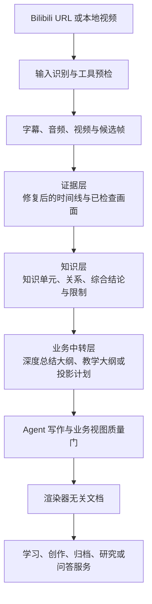

# LectureMind Video Knowledge Assets

[](./LICENSE)

> 把一段视频，变成一套可以深入学习、继续追问、再次创作、团队归档和辅助研究的知识资产。

LectureMind Video Knowledge Assets 是一个面向 Codex 的视频知识处理 Agent Skill。它接收 Bilibili URL 或本地知识视频，完成来源识别、字幕获取或语音转录、关键画面检查、证据整理、知识建模和业务化写作，将一次性的观看过程转成可追溯、可复核、可继续利用的知识服务。

同一份视频资产可以服务于不同目标：为学习者制作深度总结或课程笔记，为创作者整理有叙事结构的长文，为团队沉淀术语、流程、角色和风险，为研究者区分视频证据、分析推断与待验证问题，也可以围绕已经整理好的细粒度知识继续问答。PDF、HTML 和 Markdown 是这些能力的交付形式，不是项目本身的核心价值。

## 适用场景

| 场景 | 当前定位 | 解决的问题与提供的便利 |
| --- | --- | --- |
| 视频深度总结 | 主要能力 | 从论点、机制、例子、关键画面和限制出发重建视频逻辑，帮助读者在不反复回看的情况下深入理解内容。 |
| 课程笔记与教学讲义 | 主要能力 | 把讲解转成学习目标、前置知识、概念、机制、例题、章节小结和来源导航，便于学习、授课和复习。 |
| 创作者文章 | 初步能力 | 将视频素材转成面向读者的问题、核心观点、叙事和行动建议，降低从视频到长文的二次创作成本。 |
| 企业知识归档 | 初步能力 | 提取术语、流程、角色、输入输出、风险与适用边界，把培训或经验视频沉淀成可审计的组织知识。 |
| 研究简报 | 初步能力 | 分开呈现视频证据、Agent 分析、外部补充、限制和待研究问题，便于快速建立研究入口。 |
| 围绕总结的事实问答 | Experimental | 从细粒度知识单元、关系和原始证据窗口中检索并组织详细回答，同时标明视频未覆盖或证据不足的部分。 |

当前发布重点是深度总结与课程笔记。创作者文章、企业知识归档、研究简报和 Q&A 尚不作为默认宣传或无人审核的生产能力。

## 30 秒开始

将 `create-video-knowledge-assets/` 放入 Codex 可发现的 Skill 目录，或在请求中明确引用该目录。普通用户只需要提供视频和目标，不需要手工构造大纲、证据 JSON 或渲染命令。

**默认深度总结：**

```text
使用 $create-video-knowledge-assets 深度总结这个视频：<Bilibili URL>。
整理核心问题、机制、例子、关键画面、限制和来源导航，并生成 PDF、HTML 和 Markdown。
```

**课程笔记：**

```text
使用 $create-video-knowledge-assets，把这个视频制作成适合学习和复习的中文课程笔记：<Bilibili URL>。
保留关键画面、教学结构和来源时间脚注，并生成 PDF、HTML 和 Markdown。
```

**本地视频：**

```text
使用 $create-video-knowledge-assets 深度总结这个本地知识视频：<本地视频路径>。
先检查视频身份和工具条件，再建立证据、知识和最终文档。
```

处理 Bilibili URL 时先尝试匿名访问。只有匿名获取失败、内容确实需要登录态，并且用户明确授权时，才使用本地 Cookie 文件。详细规则见 [Bilibili Cookie 与安全边界](#bilibili-cookie-与安全边界)。

## 示例成果

| Demo | 场景 | 可直接查看 |
| --- | --- | --- |
| Transformer QKV | 课程笔记 | [PDF](./demos/BV1uPMA62E8e/summary.pdf) · [HTML](./demos/BV1uPMA62E8e/summary.html) · [Markdown](./demos/BV1uPMA62E8e/summary.md) |
| 猫为什么把幼崽叼给主人 | 深度总结 | [PDF](./demos/BV1idEL6REd3/summary.pdf) · [HTML](./demos/BV1idEL6REd3/summary.html) · [Markdown](./demos/BV1idEL6REd3/summary.md) |

Demo 仅验证了 Codex、单 P Bilibili 视频、CPU ASR 和 PDF/HTML/Markdown 路径。GPU、平台字幕、多 P 完整处理、本地视频和 Q&A 尚未由这两份 Demo 覆盖。视频封面和截图的版权仍归原权利人所有，不受本项目 MIT License 覆盖。

## 核心能力

- **获取、转录与视觉取证：** 识别 Bilibili 或本地视频，检查字幕、分 P、封面和工具状态；缺少可靠字幕时运行 Whisper，并对转录和关键画面进行人工可复核的检查。
- **证据与知识建模：** 分层保存来源时间窗、帧观察、知识单元、关系和综合结论，并通过证据状态（epistemic status）区分视频明确表达、Agent 推断、外部补充和证据不足。
- **多场景知识服务：** 从同一规范资产（canonical asset）生成深度总结、课程笔记、创作者文章、企业知识记录或研究简报，避免每个场景重复理解视频。
- **问答、渲染与治理：** 围绕细粒度知识进行证据约束问答；从同一渲染器无关文档（renderer-neutral document）生成多种阅读格式，并保留阶段哈希、恢复和清理边界。

## 设计思路

### 证据优先

视频中的知识结论先落到证据层，再进入知识层和读者文档。字幕文本、时间范围、视频帧和视觉观察均保留可追溯关系。Agent 不应把未经检查的候选帧直接当作证据，也不应把推断伪装成视频明确表达。

### 内容与格式分离

系统先建立渲染器无关文档，再生成 Markdown、HTML 和 LaTeX。PDF 由 LaTeX 编译得到，因此不同格式共享内容结构、图片和来源信息，而不是分别重写。

### 核心资产与业务视图分离

`source/`、`evidence/` 和 `knowledge/` 构成规范资产。课程笔记、创作者文章、企业归档和研究简报属于不同业务视图。二次投影只能写入自己的 `views/` 和 `outputs/`，不能反向污染原始证据与知识。

### 获取工具与知识流水线分工

- `vka` 负责输入身份、URL 规范化、元数据清洗、字幕规范化、资产边界、证据记录、质量验证、业务视图和渲染。
- `yt-dlp` 负责公开平台的元数据、字幕、封面、音频和视频获取。
- `ffmpeg` 与 `ffprobe` 负责媒体探测、音频转换和候选帧抽取。
- Whisper 仅在可靠字幕缺失时负责 ASR；ASR 结果仍需修复和审核。
- XeLaTeX 负责把通过质量门的 LaTeX 编译为 PDF。

完整命令和保留规则见 [多媒体获取说明](./create-video-knowledge-assets/references/acquisition-recipes.md)。

## 架构与数据流



`source/`、`evidence/` 和 `knowledge/` 构成规范资产。业务视图只能读取这些层，不能反向修改来源事实。写作草案可以作为 Agent 的临时工作状态，但只有通过质量门的中转计划和 `document.json` 才进入正式资产契约。

<details>
<summary><strong>开发者：查看中间层、目录和 Q&A 内部链</strong></summary>

不同业务视图使用不同的知识到文档桥梁：

- `general-deep` 使用 `knowledge/outline.json`；
- `course-notes` 使用 `knowledge/teaching_outline.json`；
- `creator-article`、`enterprise-knowledge` 和 `research-brief` 使用 `views/<profile>/projection-plan.json`；
- 所有阅读视图最终进入 `views/<profile>/document.json`，再由渲染器生成对应输出。

```text
<asset>/
├── manifest.json
├── source/                         # metadata、原始字幕、媒体、封面和 ASR 输入
├── evidence/                       # raw/repaired timeline、证据记录、候选与已检查帧
├── knowledge/
│   ├── units.jsonl                 # 原子知识单元与证据状态
│   ├── relations.jsonl             # 知识关系
│   ├── synthesis.json              # 全片综合与明确的 Agent 延伸
│   ├── outline.json                # general-deep 写作中转层
│   ├── teaching_outline.json       # course-notes 教学中转层
│   └── revisions/                  # 可选、带哈希绑定的 Q&A 知识修订
├── views/<profile>/
│   ├── view-manifest.json          # 业务视图选择原因与格式范围
│   ├── projection-plan.json        # P3 业务场景的知识到文档桥梁
│   └── document.json               # 渲染器无关文档
├── index/                          # Q&A 词法索引、拓扑和有界证据窗口
├── outputs/<profile>/              # Markdown、HTML、LaTeX 和 PDF
└── logs/                           # 本地运行信息，不得作为公开 Demo 提交
```

Q&A 内部链为：

```text
验证课程笔记资产
  -> 构建原子知识检索块（chunks）和 SQLite FTS5 词法索引
  -> 构建知识拓扑与有界证据窗口
  -> 检索证据包（grounding pack）
  -> 生成只包含引用结构的回答计划（answer plan）
  -> Agent 在证据边界内撰写详细回答
  -> validate-answer 校验事实声明（claim）、引用、时间窗、范围和状态
```

系统当前没有内置联网搜索、向量 embedding、跨资产 RAG 知识库或独立的模型 API 编排层。外部背景必须由调用方显式提供并注册，并与视频事实分区展示。

</details>

## 开发者指南

以下示例使用 PowerShell。Python CLI 和稳定测试也在 Ubuntu CI 中运行；Agent 工作流当前主要使用 Codex 进行真实视频验收，其他环境需要自行适配 `SKILL.md` 契约。

文档职责按以下边界维护：

- README 负责项目定位、用户入口、示例、能力边界和开发导航；
- [`SKILL.md`](./create-video-knowledge-assets/SKILL.md) 负责 Agent 必须执行的阶段顺序和停止条件；
- [`references/`](./create-video-knowledge-assets/references/) 负责获取、数据模型、业务视图、Q&A 和安全边界的精确契约；
- 代码与 CI 负责可执行事实和当前兼容状态。

### 环境要求

#### 必需环境

- Python 3.12 或更高版本
- `pydantic>=2.7,<3`
- `srt>=3.5,<4`
- Codex，或能够适配 `SKILL.md` 多阶段契约的兼容 Agent 环境

#### 按路径安装的外部工具

| 工具 | 何时需要 | 是否会下载额外内容 |
| --- | --- | --- |
| yt-dlp | Bilibili metadata、字幕、封面、音频或视频获取 | 会下载用户选择的媒体或字幕 |
| ffprobe | 本地视频探测 | 否 |
| ffmpeg | 音频转换和抽帧 | 会生成本地音频或图片 |
| Whisper | 无可靠字幕时进行 ASR | 首次使用可能下载模型；CPU 较慢，可选 GPU |
| TeX Live 或 MiKTeX（含 XeLaTeX） | 生成最终 PDF | 安装体积通常较大 |
| SQLite FTS5 | Experimental Q&A 索引 | Python 自带 SQLite 通常已启用，需在目标环境确认 |

安装项目本身不会下载系统工具、Whisper 模型或视频。执行具体任务时，经用户确认的 yt-dlp 和 Whisper 阶段可能下载媒体、字幕或模型；TeX 发行版需要用户自行安装。

### 安装 Python 依赖

在仓库根目录运行：

```powershell
python -m pip install "pydantic>=2.7,<3" "srt>=3.5,<4"
```

开发和测试还需要：

```powershell
python -m pip install "pytest>=8,<9" "PyYAML>=6,<7"
```

### Bilibili Cookie 与安全边界

默认先匿名获取公开 Bilibili 视频。只有匿名获取失败、目标内容确实需要登录态，并且用户明确授权时，才准备 Cookie 文件：

1. 在浏览器中正常登录 Bilibili。
2. 使用可信的 Cookie 导出工具，例如浏览器扩展 **Cookie-Editor**，只导出 `bilibili.com` 相关域名的 Cookie。
3. 优先导出为 yt-dlp 可读取的 Netscape Cookie 文件格式，并保存到仓库之外或已被 `.gitignore` 排除的本地路径。
4. 通过 `--cookie-file <path>` 或 `yt-dlp --cookies <path>` 显式传入。不要把 Cookie 内容粘贴到提示词、Issue、终端记录或配置示例中。

Cookie 等同于账户登录凭据。安装第三方浏览器扩展前应检查来源和权限；不要导出无关网站的 Cookie，也不要提交 `bilibili.txt`、`cookies.txt` 或其他真实凭据文件。默认流程不使用 `--cookies-from-browser`，避免 Agent 直接读取浏览器 profile。

### 检查 CLI 与外部工具

仓库当前没有 `vka run` 一键编排命令。Agent 应按 `SKILL.md` 和 references 中的阶段契约执行。以下命令均从仓库根目录运行：

```powershell
$VKA = "create-video-knowledge-assets/scripts/vka_cli.py"

python $VKA --help
python $VKA preflight --commands yt-dlp ffmpeg ffprobe xelatex
```

公开 Bilibili 视频可以先规范化 URL 并获取已清洗的 metadata：

```powershell
$PUBLIC_URL = "https://www.bilibili.com/video/BVxxxxxxxxxx"
$ASSET = "work/example-asset"

$source = python $VKA normalize-bilibili-url --url $PUBLIC_URL | ConvertFrom-Json
python $VKA acquire-metadata `
  --url $source.canonical_url `
  --output "$ASSET/source/metadata.json"
```

匿名获取失败且用户已经授权时，再增加可选参数：

```powershell
$COOKIE_FILE = "C:\path\outside-the-repo\bilibili.txt"

python $VKA acquire-metadata `
  --url $source.canonical_url `
  --cookie-file $COOKIE_FILE `
  --output "$ASSET/source/metadata.json"
```

如果 metadata 显示多 P 且用户未选择具体分 P，必须停止并询问，不能默认处理全部分 P。

### 获取与建立资产

继续前请阅读：

- [Skill 主工作流](./create-video-knowledge-assets/SKILL.md)
- [多媒体获取说明](./create-video-knowledge-assets/references/acquisition-recipes.md)
- [输入、恢复与保留规则](./create-video-knowledge-assets/references/p2-u1-workflow.md)
- [证据模型](./create-video-knowledge-assets/references/evidence-schema.md)
- [知识模型](./create-video-knowledge-assets/references/knowledge-schema.md)

多媒体获取采用混合方案：直接调用经过验证的 `yt-dlp`、`ffmpeg`、`ffprobe` 和 Whisper 命令，但所有产物必须写入当前资产的 `source/` 或候选区；只有经过检查并登记的内容才能进入正式 `evidence/`。

### 验证并渲染课程笔记

当 Agent 已完成教学大纲和渲染器无关的课程文档后，可以运行：

```powershell
python $VKA validate-teaching-outline `
  --input "$ASSET/knowledge/teaching_outline.json"

python $VKA render-markdown `
  --input "$ASSET/views/course-notes/document.json" `
  --output "$ASSET/outputs/course-notes/document.md" `
  --quality-floor p1

python $VKA render-html `
  --input "$ASSET/views/course-notes/document.json" `
  --output "$ASSET/outputs/course-notes/document.html" `
  --quality-floor p1

python $VKA render-course `
  --input "$ASSET/views/course-notes/document.json" `
  --output "$ASSET/outputs/course-notes/document.tex" `
  --quality-floor p1

python $VKA compile-pdf `
  --tex "$ASSET/outputs/course-notes/document.tex" `
  --output-directory "$ASSET/outputs/course-notes"
```

最终交付前必须人工检查 PDF 的中文字体、分页、公式、代码、图片清晰度和来源脚注。HTML 与 Markdown 是同一内容视图的替代阅读格式，不是独立生成的另一份总结。

## 实验性 Q&A

Q&A 的核心工程链已经实现，可以围绕通过验证的 `course-notes` 资产进行细粒度问答。它不是直接搜索 PDF 正文，而是从原子知识单元、知识关系和来源时间窗中选择证据，再由 Agent 按引用计划撰写回答。

当前能力包括：

- 回答概念、机制、流程、参数、例子、条件、限制和视频出处等详细问题；
- 使用 `video_only` 模式严格限制在视频证据内；
- 在 `video_plus_context` 或 `explore` 模式中接收显式注册的外部材料，并与视频事实分区展示；
- 在视频没有覆盖问题或证据不足时，返回对应状态，而不是自动补造结论。

项目目前没有内置联网搜索、向量嵌入（embedding）、向量数据库、跨资产 RAG 知识库或完整的 LLM API 编排。Agent 主要在选定的视频证据范围内完成详细撰写和受约束的推理补全，系统不会自行上网搜索并补全背景。

Q&A 仍标为 Experimental：工程链已经存在，但真实视频覆盖、上下文模式兼容性和端到端契约仍在验收，相关 CI 当前不阻断稳定能力发布。它适合描述为“围绕已完成视频知识资产的细粒度、证据约束问答”，不应描述为稳定的通用联网知识库或自动外部研究工具。完整工作流见 [P4 Q&A 说明](./create-video-knowledge-assets/references/p4-qa.md)。

## 输出与验收

建议交付以下内容：

- 通过质量门的 PDF 主文档；
- 同一渲染器无关文档生成的 HTML 和 Markdown（按用户要求）；
- `manifest.json` 与必要的结构化来源链（provenance）；
- 经直接检查且实际用于正文的关键画面；
- 已知限制、降级路径和人工审核记录。

自动校验不能替代人工内容验收。至少抽查关键事实、所有视觉结论、课程结构和 PDF 页面效果。

## 隐私、凭据与版权

- 只处理用户有权访问和使用的视频、字幕、封面与截图。
- 处理公开 Bilibili URL 时优先匿名访问；只有访问失败或内容需要登录态，并且用户明确授权时，才使用 Cookie 文件。
- Cookie-Editor 等第三方扩展只是一种导出方式，使用前必须检查扩展来源与权限，并且只导出 Bilibili 相关域名。
- 仅通过 `--cookie-file` 或 `yt-dlp --cookies <file>` 显式使用本地 Cookie；默认流程禁止 `--cookies-from-browser`。
- Cookie、Authorization header、浏览器 profile、签名 URL、私有媒体、绝对本地路径和原始日志不得提交到版本控制。
- 下载的视频、ASR 音频和候选帧默认视为可清理的工作数据，不应作为开源 Demo 直接发布。
- 发布示例时优先使用自有、授权或许可明确的素材，并记录来源与许可。

发现安全问题请阅读 [SECURITY.md](./SECURITY.md)。

## 已知限制

- 当前没有从 URL 到 PDF 的单一 `vka run` 命令，工作流由 Agent 按阶段执行。
- 多 P 视频必须显式选择分 P 或范围；系统不会静默处理整个合集。
- 无字幕视频依赖 Whisper 和人工修复，耗时、成本与质量受模型、硬件和音频条件影响。
- PDF 依赖本地 XeLaTeX 环境，字体和宏包差异可能导致跨平台排版变化。
- 创作者文章、企业知识归档和研究简报仍需更多真实业务验收。
- Q&A 只面向已完成的课程笔记资产，属于实验性能力。
- 任何模型生成内容都需要事实与版权审核，不适合未经复核直接对外发布。

## 测试

稳定发布测试不下载视频、不运行 Whisper，也不要求 Cookie：

```powershell
python create-video-knowledge-assets/scripts/vka_cli.py --help
python -m pytest -q --ignore-glob="tests/test_qa_*"
```

实验性 Q&A 有独立的非阻断测试任务：

```powershell
python -m pytest -q tests -k "qa_"
```

CI 使用 Python 3.12。稳定发布测试是合并门槛；Q&A 测试用于暴露仍在演进的回答版本、索引和知识拓扑契约问题，当前不阻断 `v0.1.0`。真实视频、ASR、GPU 和 PDF 视觉验收属于发布前人工验收，不放入普通 Pull Request CI。

## 参与贡献

欢迎提交 Issue 和 Pull Request。修改工作流、数据契约（schema）或安全边界前，请先阅读 [CONTRIBUTING.md](./CONTRIBUTING.md)。

## 许可证

本项目使用 [MIT License](./LICENSE)。视频、字幕、截图、字体和其他第三方内容仍受各自许可证与版权条款约束。
