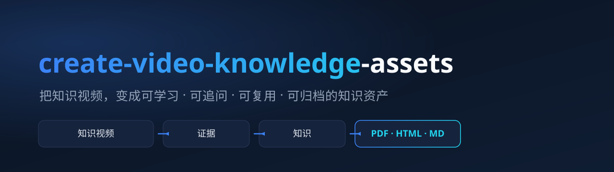

# create-video-knowledge-assets

> **把一个知识视频，变成一套可直接交付、可复用、可追溯的视频内容成品。**

[English](./README.en.md) · [快速上手](./docs/getting-started/QUICKSTART.md)



[](./LICENSE)
[](./pyproject.toml)
[](#工程质量)

---

本项目（`create-video-knowledge-assets`）是一个由 AI 驱动的视频内容再生产引擎。输入一个 **Bilibili 链接**或**本地知识视频**，它完成来源识别、字幕获取或语音转录、关键画面检查、证据整理、知识建模、`content/` 内容单元沉淀和业务化写作，最终交付一份可以直接使用的成品（**PDF / HTML / Markdown**）。

它不是"视频摘要生成器"。摘要压缩信息；它把一次性的观看过程，转成**可追溯、可复核、可继续利用**的知识资产。

## 为什么做这件事

今天很多高价值的知识沉淀在视频里，但视频天然不适合快速复习、二次创作和团队共享。用户往往要反复回看、自己做笔记、再手工整理成文——成本高，而且容易漏掉关键逻辑、例子和边界条件。

| 痛点 | 具体表现 |
| --- | --- |
| 看懂但难复用 | 看完视频后，仍需要重新整理笔记、结构和引用 |
| 关键信息分散 | 结论散落在字幕、画面和上下文中，人工整理成本高 |
| 普通摘要过薄 | 只保留结论，缺少结构、证据、例子和限制说明 |
| 场景需求不同 | 学习、创作、归档、研究需要不同深度和表达方式的成品 |

这个项目要解决的，不是"把视频压缩成短摘要"，而是**把一次观看变成可持续利用的知识结果**。

## 它做什么：能力一览

同一份视频素材，一次加工，面向四种成品 profile。

| 场景 | 面向谁 | 定位 | 说明 |
| --- | --- | --- | --- |
| 深度总结 | 学习者 | 主要能力 ✅ | `deep-summary`，从论点、机制、例子、关键画面和限制重建视频逻辑 |
| 深度文章 | 创作者 / 分析型读者 | 主要能力 ✅ | `deep-article`，把视频素材改写成可直接使用的长文 |
| 短视频脚本 | 内容创作者 | 主要能力 ✅ | `short-video-script`，沉淀可复用的钩子、转折和收束 |
| 课程笔记 | 学习者 / 教师 | 主要能力 ✅ | `course-notes`，整理学习目标、前置知识、概念、机制、例题、小结和来源导航 |

`general-deep` 和 `creator-article` 仍保留为兼容别名。

三种格式，来自同一份底稿：

- **PDF** —— 主交付物，适合阅读与存档；
- **HTML** —— 适合在线浏览与分享；
- **Markdown** —— 适合继续编辑与二次创作。

## 怎么做到的：核心设计决策

这个项目最值得讲清楚的，不是"它能做什么"，而是**它为什么这样设计**。

### 1. 证据优先：先证据，后结论

每一个知识结论都先落到证据层——字幕时间窗、关键画面、视觉观察——再进入知识和文档层。**Agent 不能把未经检查的候选帧当证据，也不能把推断伪装成视频明确表达。** 证据状态（epistemic status）明确区分：视频明确表达 / Agent 推断 / 外部补充 / 证据不足。

> 效果：读者可以顺着来源时间脚注回到原视频，复核任何一个关键论点。

### 2. 内容与格式分离：知识到内容，再到格式

系统先建立一份与渲染器无关的底稿，再把知识层提炼成 `content/` 可复用内容单元，最后生成 Markdown、HTML 和 LaTeX（PDF 由 LaTeX 编译得到）。**内容单元、图片和来源信息共享，而不是每种格式各写一遍**，避免漂移。

### 3. 一个资产，多视图：内容单元复用

`source/`、`evidence/`、`knowledge/` 构成规范事实层，`content/` 负责承接可复用的内容单元。课程笔记、深度文章、短视频脚本和其他业务视图是**同一份资产的不同成品**。业务视图只能读取底层、写入自己的 `views/` 和 `outputs/`，不能反向污染原始事实。

> 效果：同一个视频不必为每个场景重复理解一遍；一次加工，多场景复用。

### 4. 质量门与人工介入：不是全自动黑箱

系统用阶段契约、质量门和人工审阅点控制过程：多分 P 视频必须显式选择范围；字幕缺失时降级到 Whisper 转录但保留修订痕迹；证据不足时必须降级标注而不是硬补；**对外发布前保留人工审核点。**

## 真实成果

### 端到端 Demo（从 Bilibili URL 到交付物）

| Demo | 场景 | 直接查看 |
| --- | --- | --- |
| Transformer 的 QKV | 课程笔记（Whisper 无字幕转录 + 312 段时间线 + 8 张已检查画面） | [PDF](./demos/BV1uPMA62E8e/summary.pdf) · [HTML](./demos/BV1uPMA62E8e/summary.html) · [Markdown](./demos/BV1uPMA62E8e/summary.md) |
| 猫为什么把幼崽叼给主人 | 深度总结（含证据边界与视频导航） | [PDF](./demos/BV1idEL6REd3/summary.pdf) · [HTML](./demos/BV1idEL6REd3/summary.html) · [Markdown](./demos/BV1idEL6REd3/summary.md) |

这两份 Demo 走完了从 URL、字幕/转录、抽帧检查、知识建模、写作到 PDF/HTML/Markdown 的完整链路。第二份尤其能体现产品理念：正文明确区分"视频如何解释"与"本 demo 是否独立证实"，并附可回看复核的时间窗表——**这就是证据优先的产品化表达。**

**当前验证范围**：这两份 Demo 验证了 Codex、单 P Bilibili 视频、CPU ASR 和 PDF/HTML/Markdown 路径。GPU、平台字幕、多 P 完整处理和本地视频尚未由 Demo 覆盖。

## 架构与数据流（概览）

```text
 Bilibili URL 或本地视频
        │
        ▼
输入识别与工具预检 ────► 字幕 / 音频 / 视频 / 候选帧
        │                        │
        ▼                        ▼
  证据层（修复后时间线 + 已检查画面）──► 知识层（知识单元 / 关系 / 综合结论 / 限制）
        │                                    │
        ▼                                    ▼
         content/ 内容单元 ───────────────► views/<profile>/
        │
        ▼
 与渲染器无关的文档 ──► PDF / HTML / Markdown
        │
        ▼
 学习 · 创作 · 归档 · 发布
```

完整架构、资产布局与数据契约见 [docs/ARCHITECTURE.md](./docs/ARCHITECTURE.md)。

## 快速上手

普通用户只需要提供视频和目标，不需要手工构造大纲、证据 JSON 或渲染命令。

**默认深度总结：**

```text
使用 $create-video-knowledge-assets 深度总结这个视频：<Bilibili URL>。
整理核心问题、机制、例子、关键画面、限制和来源导航，并生成 PDF、HTML 和 Markdown。
```

**课程笔记：**

```text
使用 $create-video-knowledge-assets，把这个视频制作成适合学习和复习的中文课程笔记：<Bilibili URL>。
保留关键画面、教学结构和来源时间脚注，并生成 PDF、HTML 和 Markdown。
```

**本地视频：**

```text
使用 $create-video-knowledge-assets 深度总结这个本地知识视频：<本地视频路径>。
先检查视频身份和工具条件，再建立证据、知识和最终文档。
```

**Bilibili 视频需要显式提供 Cookie：** Bilibili 的公开接口普遍需要登录态才能稳定获取字幕与元数据。先在浏览器中登录 Bilibili，再用浏览器插件 **Cookie-Editor** 导出 `bilibili.com` 相关域的 Cookie（Netscape 格式），通过 `--cookie-file <path>` 显式传入。Cookie 等同于账户登录凭据：只导出 Bilibili 相关域，不要上传仓库或粘贴到公开内容中。

完整的安装与示例见 [docs/getting-started/QUICKSTART.md](./docs/getting-started/QUICKSTART.md)。

## 工程质量

- **语言 / 环境**：Python 3.12+，`pydantic`、`srt`；外部工具 yt-dlp / ffmpeg / Whisper / XeLaTeX 按需调用；
- **代码规模**：约 1.1 万行 Python，28 个功能模块，31 个测试文件；
- **测试**：`python -m pytest -q`（全套 477 通过，Python 3.11 / 3.12 / 3.13 均可复现）；
- **CLI**：`vka` 提供 31 个阶段命令，覆盖获取、证据、知识、内容、视图、渲染全链路；
- **契约**：23 份 schema / 工作流 / 安全契约文档，见 [`references/`](./create-video-knowledge-assets/references/)；
- **CI**：[`.github/workflows/ci.yml`](./.github/workflows/ci.yml)，stable（阻断）+ experimental（不阻断）双任务；
- **安全边界**：Bilibili 内容需显式 Cookie（Cookie-Editor 导出）；凭据、私有媒体与日志不入库。详见 [SECURITY.md](./SECURITY.md)。

## 仓库结构

```text
├── create-video-knowledge-assets/   # Skill 本体（SKILL.md、scripts/、references/、assets/）
├── docs/                            # 产品与工程文档（架构、能力地图、快速上手）
├── demos/                           # 端到端 Demo 成果（PDF / HTML / Markdown）
├── tests/                           # 稳定测试 + 实验性测试
└── CHANGELOG.md / LICENSE / SECURITY.md / CONTRIBUTING.md
```

## 项目演进与 Roadmap

这个项目从一份产品需求文档出发，定义了一条产品主线：**先证据，后结论；先结构，后修辞；先可追溯，后可发布；先把一个场景做深，再扩展。** v0.1 完成了这条主线的核心工程链。

| 阶段 | 目标 | 状态 |
| --- | --- | --- |
| 第一阶段：可用 | 单视频、深度总结 / 课程笔记、PDF / HTML / Markdown、证据追溯 | ✅ v0.1 已交付 |
| 第二阶段：可复用 | 深度文章、短视频脚本、更多内容 profile | 🧪 初步实现，待更多真实业务验收 |
| 第三阶段：可产品化 | 质量门、发布审核、异常恢复、规模化复用 | 🔜 规划中 |

变更记录见 [CHANGELOG.md](./CHANGELOG.md)。

## 文档导航

| 文档 | 内容 | 适合谁 |
| --- | --- | --- |
| [快速上手](./docs/getting-started/QUICKSTART.md) | 30 秒开始 + 分场景示例 | 普通用户 |
| [架构与数据流](./docs/ARCHITECTURE.md) | 资产布局、流水线、数据契约、content/view 夹层 | 工程师 |
| [能力地图](./docs/SKILLS_CATALOG.md) | 4 类成品输出 + 独立实验能力 + P1–P4 流水线 + 契约索引 | 想理解边界的人 |

## 隐私、版权与许可

- 只处理用户有权访问和使用的视频、字幕、封面与截图。
- Cookie 等同于账户登录凭据：只导出 Bilibili 相关域，且绝不上传仓库。
- 视频封面和截图的版权归原权利人所有，不受本项目 MIT License 覆盖。
- 本项目代码使用 [MIT License](./LICENSE)。

发现安全问题请阅读 [SECURITY.md](./SECURITY.md)。欢迎提交 Issue 和 Pull Request，修改工作流、数据契约或安全边界前请先阅读 [CONTRIBUTING.md](./CONTRIBUTING.md)。
