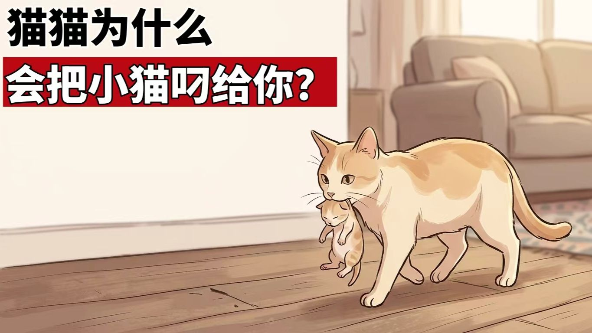
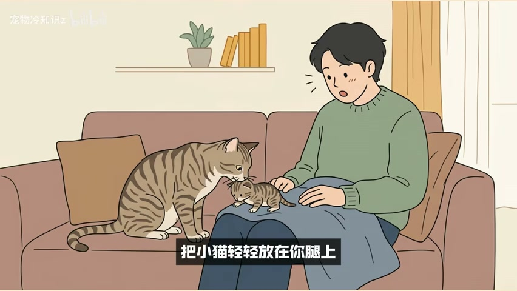
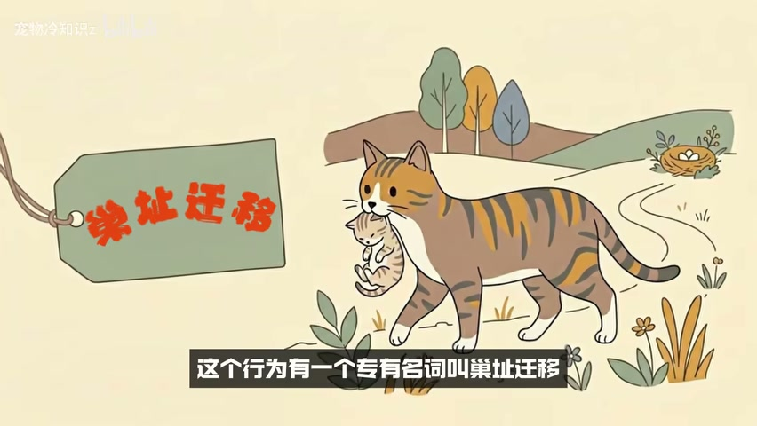
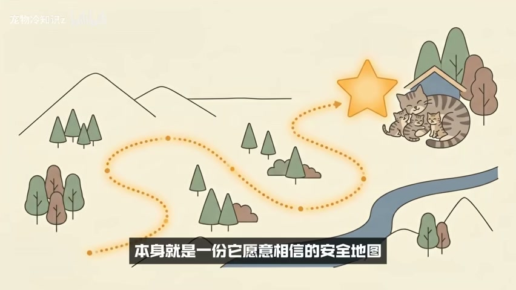
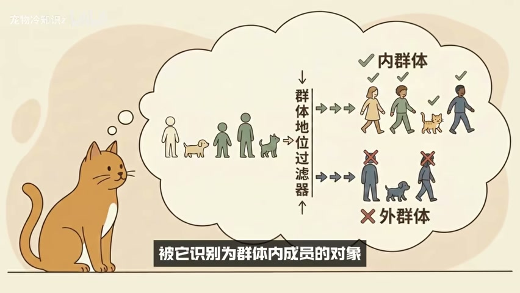
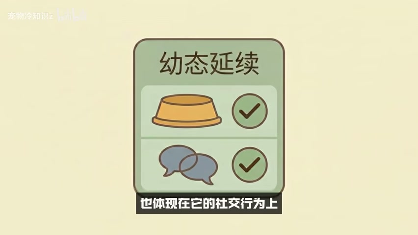
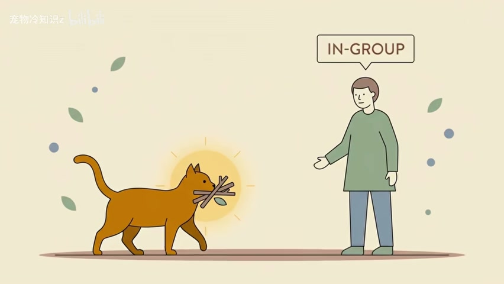
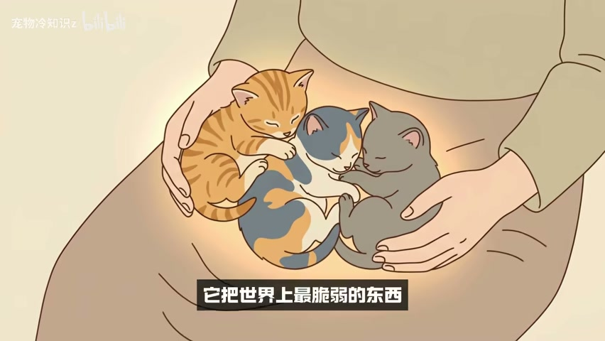

# 猫为什么把幼崽叼给主人：从安全地图到群体信任

## 家猫行为中的安全判断、群体识别与信任积累

> 视频认为，母猫把幼崽叼给主人，不是为了炫耀，而是把人判断为可信的群体成员和安全地点。

一份基于视频转录与直接画面检查的深度总结

- **视频名称**：猫猫为什么会把小猫叼给主人
- **作者/UP主**：宠物冷知识z
- **发布时间**：2026-06-09
- **视频时长**：06:28
- **转录来源**：faster-whisper small（CPU int8），结合视频内嵌字幕人工校对
- **视频链接**：https://www.bilibili.com/video/BV1idEL6REd3

## 先给结论：这不是一场“炫耀”

视频从一个常见场景切入：母猫离开产房，把尚未睁眼的幼崽逐只叼到主人身边。它随后否定两种直觉解释——母猫不是单纯来求助，也不是像人一样展示自己的“成果”。视频真正想建立的主线是：在产后高度警觉的阶段，母猫愿意转移最脆弱的幼崽，并把它们放到某个人身边，本身就是一次强烈的安全判断。

> **核心提示**
>
> 阅读这份总结时要抓住一个区分：本文整理的是视频如何解释这一行为，而不是宣告这些动物行为学因果链已经被本 demo 独立证实。

“炫耀说”之所以被视频反驳，是因为它把人的成就展示动机投射给了猫。视频认为，家猫不会为了被夸奖而行动，也不会为了分享喜悦主动寻找观众。无论这一概括是否足够严谨，它在视频中的作用很清楚：先拆掉拟人化解释，再把注意力转向风险、地点与群体关系。

## 第一层机制：巢址迁移在选择安全地点

视频把母猫搬运幼崽称为“巢址迁移”。它强调，这不是轻松的搬家：运输过程中幼崽完全暴露，母猫一旦遇到威胁也难以同时保护幼崽。因此，搬去哪里并非随意决定，而是一张由母猫风险评估画出的安全地图。

在这套解释里，主人并不是与地点无关的旁观者。视频说，家养母猫评估安全时，不只看房间、窝点或路线，也把群体成员纳入判断。当幼崽被叼到人身边时，人本身就成为安全环境的一部分。

## 第二层机制：群体识别在选择可信对象

仅有安全地点还不够解释“为什么是你”。视频引入共同抚育与群体识别：稳定群体中的母猫可能相互照看、哺乳和搬运幼崽，但交付对象必须先被识别为群体内成员。它把这套逻辑从流浪猫群体搬到家庭客厅，认为主人能否接触幼崽，取决于猫长期形成的内群体判断。

这个判断不是在叼来幼崽的那一刻临时产生。视频列出一系列日常线索：人的气味是否稳定、作息是否规律、靠近时是否让猫安心，以及人在情绪不好时是否仍然温柔。后半段又把它概括为成千上万个被猫默默观察的瞬间。叼来幼崽只是最终结果，信任的形成早已发生在日常。

视频还借“幼态延续”补充这套群体逻辑：家猫保留了部分幼猫期的社会模式，并把它投射到人与猫的关系中。这里应保持证据层级：视频提到了学者和演化解释，但没有提供书目、论文或可核验原文，因此它适合用来理解视频论证结构，不宜在没有外部证据时直接写成科学共识。

## 为什么玩具、袜子和猎物也能放进同一框架

视频随后处理一个反例：没有生过幼崽的猫，也会把袜子、玩具、虫子甚至猎物叼给主人。它认为两类行为在底层有重叠，都可以简化为“把一个对自己有特殊意义的对象带到群体内成员身边”。在野外，这接近猎物分享；在家庭中，视频承认科学界对其具体解释仍在进行。

> **核心提示**
>
> 视频在这里留下了重要边界：家中叼物行为没有统一名称，相关解释仍在进行。因而“它一定是在送礼”或“它一定把你当幼崽”都超出了视频自己承认的证据范围。

## 收到幼崽时，视频建议怎样回应

在行动层面，视频的目标不是让人做复杂干预，而是避免用强刺激打断母猫刚刚做出的安全判断。它给出的建议可以整理为四步：先不把幼崽立即送回，不用高声和兴奋回应，不要立刻起身离开，并在原地安静陪伴一段时间。

- 保持动作轻缓，先观察母猫是否仍在继续搬运。
- 避免大声说话、围观或反复触碰幼崽。
- 不要因感动而马上离开；视频认为这可能被理解为拒绝。
- 短暂安静陪伴，给母猫确认环境稳定的时间。

结尾把前面的机制转成更具情感的表达：猫科动物对大型潜在威胁保持警觉，而一只家猫对人的信任来自长期观察。当它愿意在转身去叼下一只幼崽时把上一只留在你身边，视频把这理解为它相信你不会成为威胁。最终，视频把这层关系浓缩为一句话：你是它愿意把孩子放下来的那个地方。

## 证据边界：哪些只是视频观点

> **核心提示**
>
> 这份 demo 没有使用外部背景材料。约翰·布拉德肖、猫科演化、共同抚育、幼态延续及“陌生对象不会收到叼物”等论断，均按视频观点呈现，没有被独立核验。

视频的解释很完整，但完整不等于证据充分。它把巢址迁移、群体识别、幼态延续和猎物分享串成一条连贯因果链，却没有在画面或口播中提供论文标题、研究设计、样本范围与反例条件。因此，本文可以准确复述它“怎样解释”，不能替它证明“所有母猫都因此行动”。

另一个交付边界是健康与照护。视频只讲一般互动，没有讨论母猫产后异常、幼崽失温、拒乳、窝点污染或持续搬运等风险。如果现实场景出现异常叫声、精神差、出血、幼崽冰冷或母猫持续焦躁，应优先处理健康与环境问题，并咨询兽医，而不是只执行视频中的情绪回应建议。

## 视频导航：去哪里复核关键论点

下面的时间窗用于回到原视频复核主线。它们来自修复后的 ASR 时间轴，并与最终采用画面交叉检查；时间为近似窗口，不应替代原视频上下文。

| 时间窗 | 内容 | 复核重点 |
| --- | --- | --- |
| 00:00–01:04 | 场景与反驳炫耀说 | 视频如何建立核心问题 |
| 01:04–02:16 | 巢址迁移与安全地图 | 搬运风险如何导出安全判断 |
| 02:30–03:24 | 共同抚育与群体识别 | 为什么主人被视为内群体 |
| 03:24–04:25 | 玩具、猎物与叼物行为 | 视频承认了哪些未决解释 |
| 04:25–04:50 | 收到幼崽后的回应 | 不要送回、激动或离开 |
| 04:50–06:28 | 信任积累与最终结论 | “你是安全地点”的叙事如何收束 |
