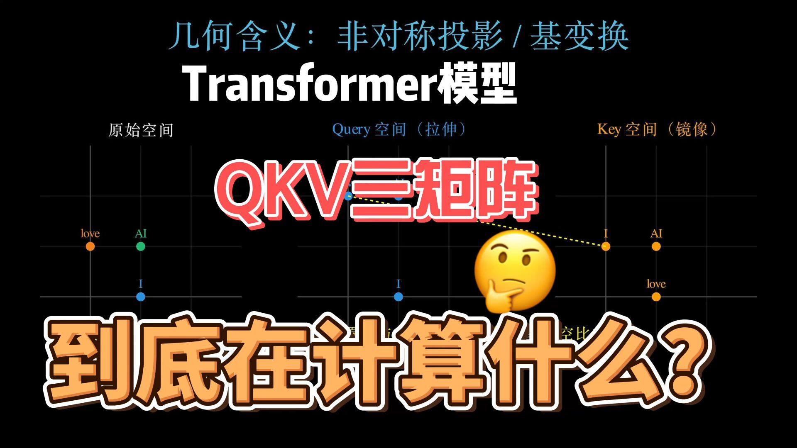
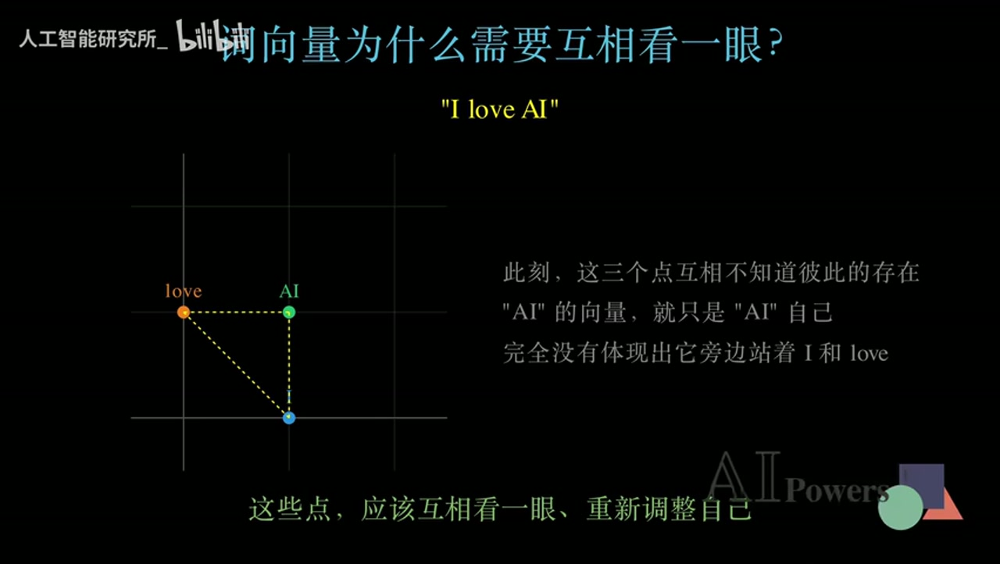
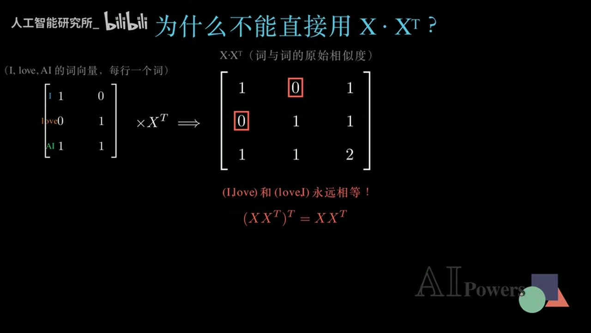
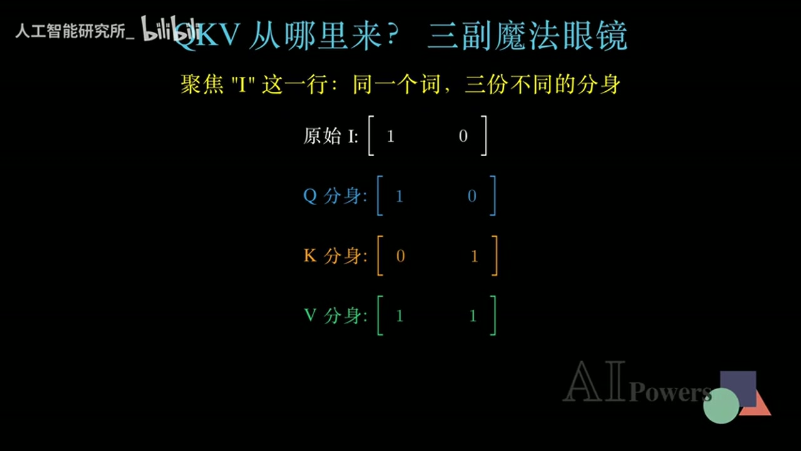
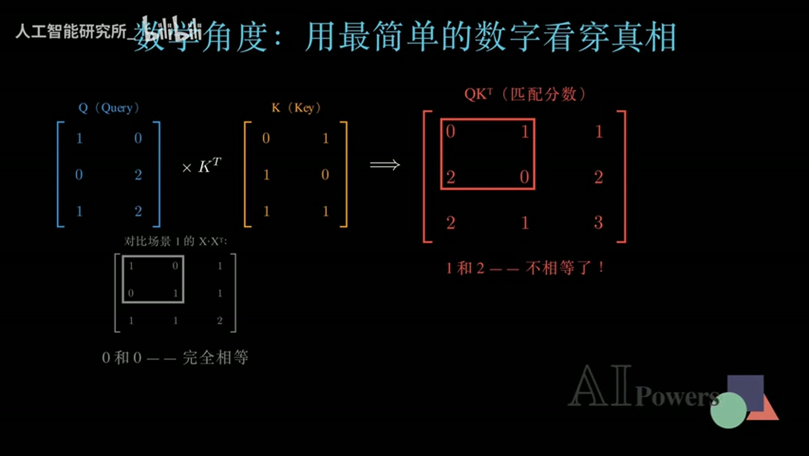
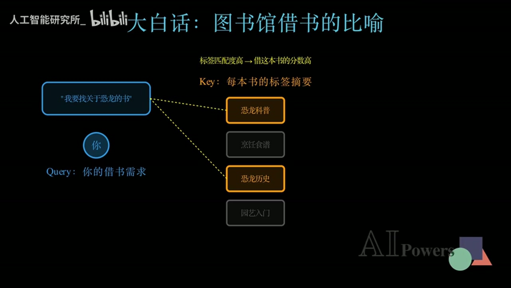
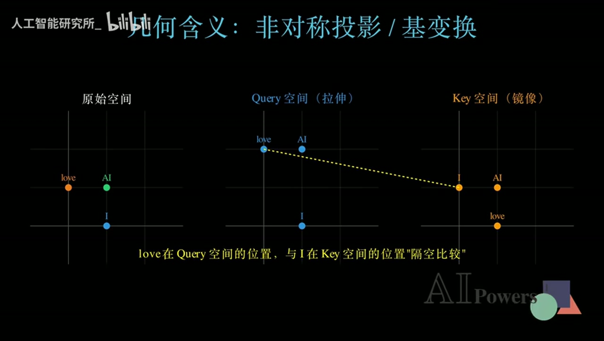
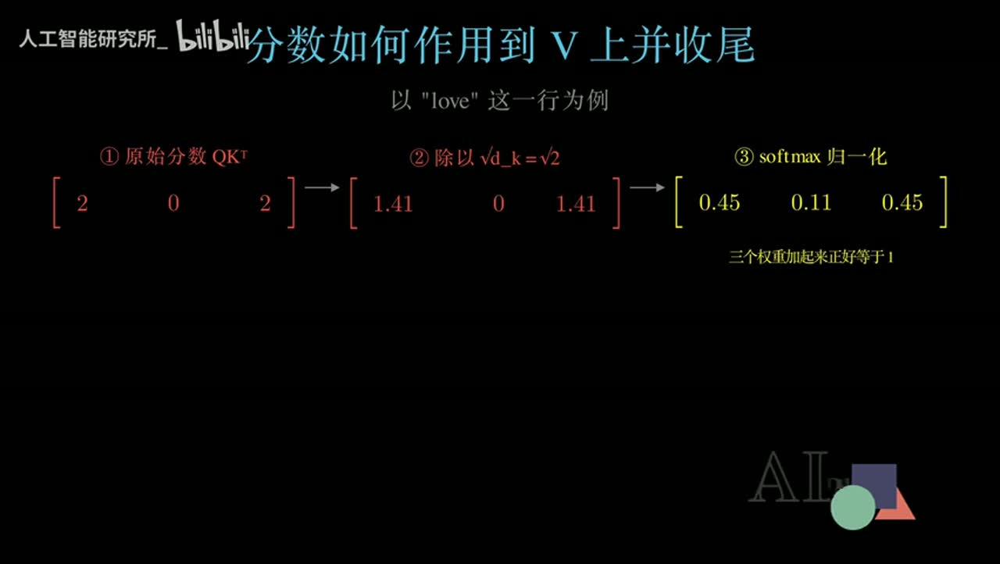
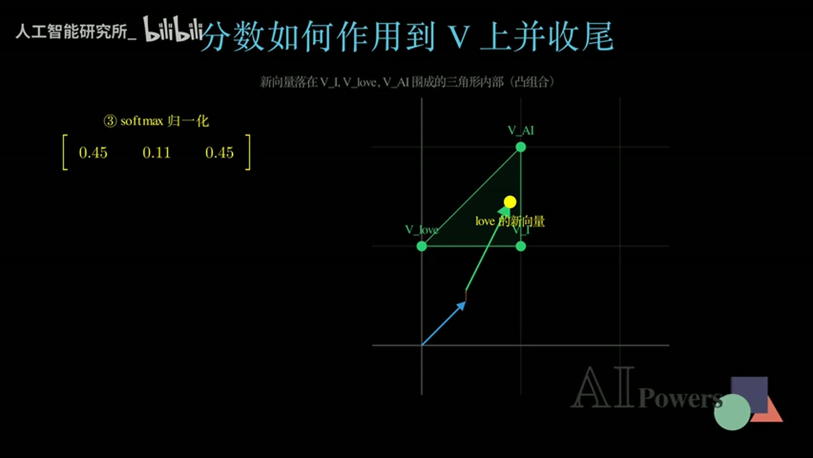

# 真正理解 Transformer 的 QKV

## 为什么注意力需要三种角色表示

> Q 和 K 学习从哪里取信息，V 承担实际传递的内容，三者共同把孤立词向量改写为有方向、可学习的上下文表示。

从对称相似度、方向性匹配到上下文表示

- **视频名称**：Transformer 模型为何需要 QKV 三个矩阵？QKV 到底在计算什么？
- **作者/UP主**：人工智能研究所_
- **发布时间**：2026-07-04
- **视频时长**：09:55
- **转录来源**：Whisper small（faster-whisper CPU int8），经自动建议与人工上下文复核修订
- **数据来源**：视频元数据、修订后的 312 段时间线、8 张直接检查的关键画面
- **视频链接**：https://www.bilibili.com/video/BV1uPMA62E8e

## 核心问题：词向量为什么要互相看一眼

> **核心主线**
>
> 注意力不是从 Q、K、V 三个字母开始的。它首先要解决一个更朴素的问题：初始词向量彼此孤立，只有让每个词按相关程度吸收上下文信息，句子中的角色和关系才会进入表示。

### 孤立向量缺少什么

词嵌入把 I、love、AI 分别变成向量，但这一步只给出了每个词自己的初始位置。AI 的向量并不知道旁边站着 I 和 love，love 也尚未知道谁是动作发出者、谁是动作对象。换句话说，初始向量有词义，却没有当前句子的关系。

### 从相互感知到动态表示

注意力机制让当前词先判断其他词与自己有多相关，再按相关程度吸收它们携带的信息。这样得到的新向量不再是词典式的固定坐标，而是针对当前句子临时生成的动态表示。同一个 love 出现在不同句子里，可以因为周围词不同而获得不同结果。

### 本章小结

先不要急着背公式：注意力的任务是把上下文写回词表示。只要一个词仍然是互不相知的孤立点，模型就还没有完成对句子结构的建模。

## 错误直觉：为什么 X X 的转置走不通

### 最直接的相似度方案

最自然的想法是把所有词向量按行堆成矩阵 X，再计算 X X 的转置。结果矩阵中的每个元素都是两个词向量的点积，可以理解为两词的原始相似度。这个方案计算简单，也确实给出了完整的两两匹配分数。

直接相似度矩阵

$$
S = X X^{T}, \qquad S_{ij}=x_i \cdot x_j
$$

符号说明：
- X：按行堆叠的词向量矩阵
- S：词与词的点积相似度矩阵

### 对称性与不可学习性

点积具有交换性，因此第 i 个词对第 j 个词的分数必然等于反向分数。可语言关系通常有方向：作为动词，love 需要寻找主语 I 和对象 AI；代词 I 却未必以同样程度依赖 love。对称矩阵把这种角色差异从结构上抹掉了。

> **两个死穴必须同时看到**
>
> 直接使用 X X 的转置不只会锁死方向，它还没有额外的可学习匹配参数。模型无法通过训练调整‘应该关注谁’，因此即使计算出了相似度，也不是足够灵活的注意力机制。

### 本章小结

静态相似度不是注意力的终点。一个可用的方案必须让反向关系可以不同，还必须让匹配规则能通过数据学习；这正是引入 Q、K、V 三组投影的原因。

## QKV：三副可学习眼镜如何打破对称

### 同一个输入的三种角色

视频把 W_Q、W_K、W_V 比作三副魔法眼镜。输入 X 经过三组不同、可学习的线性变换后，得到 Query、Key、Value。Query 表示‘我想寻找什么’，Key 表示‘我可以如何被匹配’，Value 表示‘匹配后我真正传递什么’。

三组角色投影

$$
Q=XW_Q, \qquad K=XW_K, \qquad V=XW_V
$$

符号说明：
- W_Q、W_K、W_V：由训练学习的投影矩阵
- Q/K：用于匹配，V：用于内容汇聚

### 不同投影如何产生方向性

由于 W_Q 与 W_K 不同，同一个词在提问角色和被匹配角色中的表示不同。于是 QK 的转置不再继承 X X 转置的强制对称性：love→I 与 I→love 可以得到不同分数，模型也能通过训练调整这种差异。

在二维示例里，love 关注 I 的分数高于 I 关注 love 的分数。这个数值只是教学用玩具结果，但它准确展示了结构能力：同一对词的两个方向不必相等，注意力可以学习谁在当前关系中更需要谁。

### 本章小结

QKV 不是三个独立对象，而是同一输入的三种可训练角色。Q/K 负责建立方向性匹配，V 保留待传递的内容；角色分离同时带来了非对称性和可学习性。

## 两套直觉：图书馆类比与几何投影

### 图书馆：先匹配标签，再取走内容

想找恐龙书的需求是 Query；每本书的标签摘要是 Key；真正的书中内容是 Value。你先用需求与标签比较，找出高匹配书籍，但最后带走的是内容而不是标签。这个类比把匹配通道与内容通道清楚分开。

> **不要混淆 Key 与 Value**
>
> Key 像可检索的标签，负责让内容被找到；Value 才是后续加权汇入输出的信息。如果把两者混为一谈，就无法解释为什么匹配分数最终还要乘 V。

### 几何：在两套子空间中隔空比较

几何视角把 W_Q 看作对原始空间的拉伸，把 W_K 看作另一种基变换。于是同一个词在 Query 空间和 Key 空间中的位置不同。匹配分数是两个不同空间表示之间的点积，反向比较交换了角色，自然不再要求结果相等。

### 本章小结

图书馆类比回答‘Q/K/V 分别做什么’，几何投影回答‘为什么 QK 的转置可以非对称’。能同时说清匹配、内容和方向性，才算真正跨过了只会背字母的阶段。

## 从匹配分数到新的上下文表示

### 缩放与 Softmax：把分数变成比例

QK 的转置只产生原始匹配分数。视频接着把分数除以根号 d_k，控制高维点积的幅度，再通过 Softmax 转换成非负且总和为 1 的权重。这样，抽象分数就变成了当前词对各位置分配的注意力比例。

缩放点积注意力的完整形式

$$
\operatorname{Attention}(Q,K,V)=\operatorname{softmax}\!\left(\frac{QK^{T}}{\sqrt{d_k}}\right)V
$$

符号说明：
- QK^T：方向性匹配分数
- d_k：Key 的维度
- Softmax：把分数归一化为权重
- V：被权重汇聚的内容表示

### 为什么最后必须乘 V

权重本身只说明该去哪里取信息，仍不是新词表示。把每个权重乘到对应 Value 向量上并求和，才得到当前词的输出。对 love 而言，新向量混合了 I、love、AI 的内容，因此它的位置和含义都被当前上下文重新塑造。

> **几何上的凸组合**
>
> Softmax 权重非负且总和为 1，因此加权结果位于 Value 向量的凸包中。视频的二维示例把它画成三角形内部的一个点，直观展示输出如何由多个上下文来源共同组成。

### 本章小结

完整注意力不是一次矩阵乘法，而是一条信息路由链：Q/K 计算方向性相关度，缩放和 Softmax 形成稳定权重，V 的加权和把相关上下文写入当前词。

## 总结、常见误区与延伸练习

### 一条可复述的因果链

从问题出发复述全片：初始词向量缺少上下文；X X 的转置虽然能算相似度，却对称且不可学习；W_Q 与 W_K 让提问和被匹配使用不同表示；缩放与 Softmax 把 QK 的转置变成权重；权重汇聚 V，形成新的上下文表示。

### 三个常见误区

- 误区一：Q、K、V 是三个不同的词。实际上它们是同一输入的三种角色投影。
- 误区二：Key 是最终取出的内容。实际上 Key 用于匹配，Value 才承载被汇聚的信息。
- 误区三：二维单头手算就是完整 Transformer。它只负责建立机制直觉，未覆盖多头、掩码、残差与高维实现。

### 自测与下一步

1. 不用公式解释：为什么 love→I 与 I→love 不应被强制相等？
2. 画出图书馆类比，分别标出 Query、Key、Value，并说明最后真正带走的是什么。
3. 从 QK 的转置开始，口述缩放、Softmax 和乘 V 的每一步职责。
4. 进一步学习多头注意力、掩码、残差连接，并比较它们与本视频单头玩具例子的边界。

> **最后带走的一句话**
>
> Q 和 K 学习‘从哪里取’，V 承担‘实际取什么’；注意力用方向性权重把相关上下文写回每个词，使词义成为随句子变化的动态表示。
