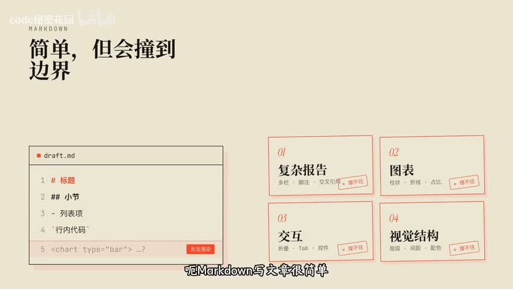
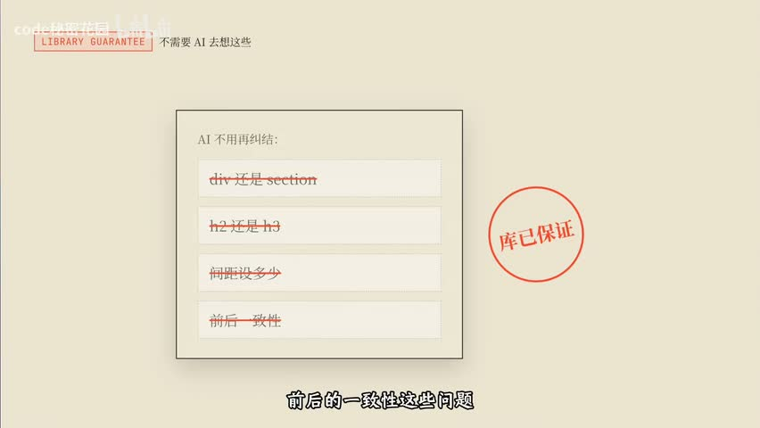
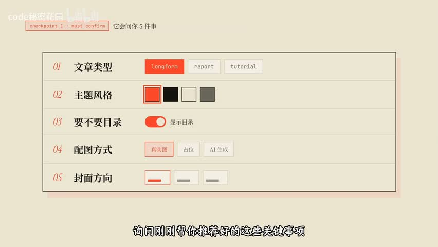
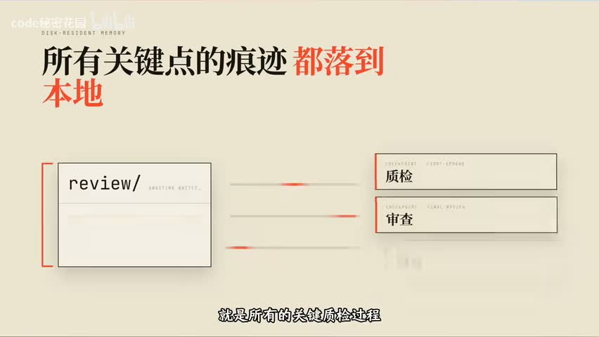

# 把一段文字变成一篇好文章，为什么不能只靠模型写得好

## 约束不是限制 AI，而是让它能稳定出货

> 视频用同一套 Harness 骨架，把“让 Agent 把任意文字变成精美长文”做成了一个可控的生产流程：不让模型裸写 HTML，而是让它组合受约束的组件、停在检查点让人拍板、把状态写进文件、让独立视角终审。

一篇基于视频证据的工程复盘

- **视频名称**：Harness 实践：将任何文字编辑成精美的文章
- **作者/UP主**：code秘密花园
- **发布时间**：2026-06-17
- **视频时长**：20分37秒
- **字幕来源**：平台字幕不可用
- **转录来源**：faster-whisper base（CPU int8）逐行审校：606 段中 3 段标记为不确定
- **视频链接**：https://www.bilibili.com/video/BV1ayLD6uERL

## 问题不在模型写得不够好

你可能刚把一篇很长的调研文档丢给 Agent，让它整理成一篇能发出去的文章。稿子确实出来了，但读起来像一份加长版摘要：段落一样宽，没有节奏，图表无处安放，代码块和公式混在正文里，最后排版还得自己动手。换一个更强的模型，句式会漂亮一些，可结构并没有变得更可控。

视频给出的判断是：问题不在于让模型更会写，而在于没有一套结构去管住这件事。它用同一套 Harness 骨架做了一次验证——上一次是自动做视频，这一次是把任意文字变成排版精美的长文，而两次的骨架几乎一样。

*这张对照图出自视频开场，用来解释为什么写文章要换一种载体。*

## 核心判断：约束不是限制，是把结果变成可复现

视频要验证的观点是：成熟 Harness 的六层骨架——上下文管理、工具系统、执行编排、状态与记忆、反馈与观测、约束与恢复——可以从视频场景迁移到文章场景。变化的是任务，不变的是把关键决策变成检查点、把状态写进文件、把质量交给独立审核、把修复限制在最小切片。一次做出效果靠的是模型能力，稳定生产一类效果靠的是这套结构。

## 从“让模型写 HTML”到“让模型组合组件”

视频承认 HTML 的优势：信息密度高，表格、SVG、看板、片段和公式可以随意组合；标题层级、颜色和间距能被精确控制；折叠和 Tab 这类交互可以做；分享只要一个链接。但它紧接着划出一条线：HTML 很强，不代表应该让模型去裸写 HTML 和 CSS。内容一长、视觉元素一多，单文件就会变得很大，后续难改难维护，效果不可控，而且很容易让文字失去文章感，看起来像网页应用。

它的解法是给 AI 一套专门用来写文章的语义化组件协议，名字叫 Reacticle，是 React 加 article 的合成词。一句话定位是：Markdown 让人可以轻松地写文章，Reacticle 让 AI 可以可控地生成长文 HTML。AI 只负责组合组件，排版结构、样式一致性和前后一致性交给库来保证。

只有固定组件会不会太死板？协议留了一个叫 Raw 的逃生舱组件：任意 HTML 都能塞进去，做时序图或交互式画块都行，但有一条硬约束——Raw 里的样式必须遵循当前主题风格。主题也不是一套配色，而是两份东西：一份定义颜色、字体、间距、阴影的样式约束，一份写给 AI 的说明，规定这套主题该配什么图、能不能用渐变和阴影、图表要不要极简。约束的是风格稳定性，不是创作自由。

视频用一个比方讲清两层的关系：Reacticle 是乐高积木，规定了有哪些零件、长什么样、颜色怎么搭配，管的是拼出来稳不稳、好不好看；beautiful-article 这个 Skill 是拼装说明书，告诉你先拼哪块、拼完检查什么、最后怎么交付，管的是生产过程可不可控。一个管输出质量，一个管生产流程，两层配合才能稳定出货。

## 这套流程实际跑起来是这样的

视频用一篇英文博客做示范，流程是九步、三个检查点。第一步整理素材：无论输入是链接、PDF 还是纯文本，都先统一成一份 Markdown 作为后面所有写作的事实来源，拿不准的地方（图片缺失、表格不完整、链接失效）单独记录下来交给人判断。第二步出方案：产出一份编辑计划，写清面向谁、保留多少原文信息、章节怎么分、选什么视觉主题，但只给建议，不替用户做决定。

用户确认方案之后，它也不会直接写完：先做封面、第一节和一个代表性模块来定调，然后停在第二个检查点让人提意见。这一步的取舍很清楚——首屏和第一节基本上决定整篇文章的基调，所以要在改写成本最低的地方改，越往后返工越贵。确认之后才逐章开发，并让用户选择单 Agent 的顺序模式还是多 Agent 的并行模式。

- 终审由三个独立审查者完成：内容审查看完整性、信息取舍和结构；视觉审查看主题、Raw、配图与移动端适配；技术审查看构件空态、代码块与公式渲染。
- 发现的问题不做整体重写，只做最小切片修复：哪一节有问题补哪一节，哪个 Raw 有问题改哪个 Raw。
- 所有质检与修复的记录都写进本地文件——它们既能给人看，也能给 Agent 回看。
- 最后一个检查点决定交付形态：只导出 HTML，还是同时导出 HTML 和 PDF。

## 把这段流程拆成五个可以自查的问题

视频的六层框架是它的组织方式，落到自己的流程上，我会把它压缩成五个可以直接问出口的问题。它们不需要你重写现有工具，只需要你在关键位置插一道判断。

- 关键决策有没有停下来让人拍板？在最便宜的时机停：先做一小块定调，再让用户决定方向和开发模式。
- 上下文有没有分阶段加载？不同阶段只看这个阶段需要的文档，初始就把全部规范塞进去会稀释注意力。
- 状态有没有写进文件？工作记忆落在本地的计划与记录里，写到后面章节时回去读文件，而不是凭记忆回忆。
- 质检有没有独立视角？内容、视觉、技术三路各审各的，关键节点必须由独立审查者完成。
- 修复有没有限制在最小切片？只改出问题的那一节或那一个组件，并保护已经确认过的部分。

## 边界：哪些是视频说的，哪些是本文的整理

本文区分两类内容。第一类是视频明确表达或展示的：HTML 与 Markdown 的能力边界、不该让模型裸写 HTML 的理由、Reacticle 的组件与主题设计、检查点的岗位、三路独立审查与最小切片修复，以及交付环节的实际结果。第二类是本文的归纳：把六层骨架压缩成五个自查问题，以及“换到周报、播客、课程讲义等场景同样成立”这一判断，来自视频的主张，本文没有做跨场景验证。

- 组件协议的具体 API、组件清单与主题参数以官方文档为准，本文只按视频口径复述其设计意图。
- 平台字幕不可用，正文基于 faster-whisper base 转录并逐行审校；606 段中有 3 段无法确认，本文不引用这些句子里的人名、仓库名与数值。
- 视频中的效果演示（导出 HTML 与 PDF、移动端适配）是视频自身展示的结果，本文不复述为独立复现。
