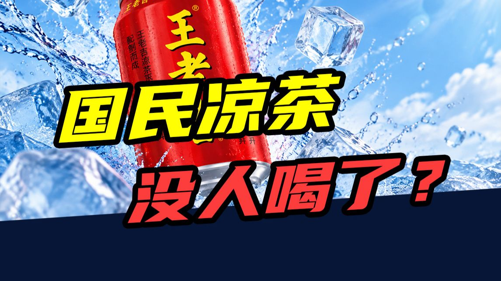
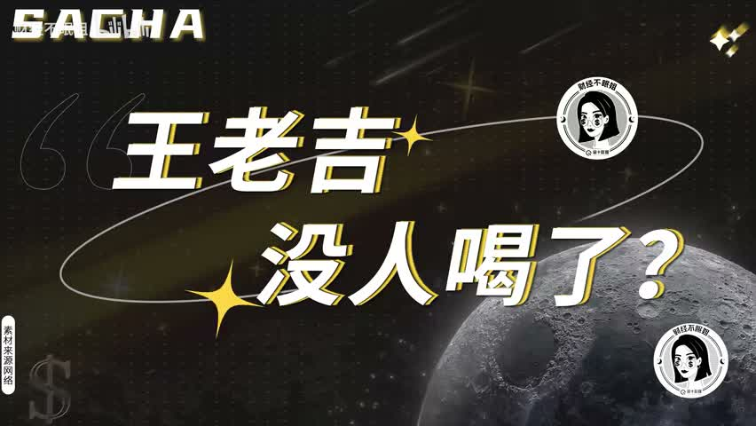
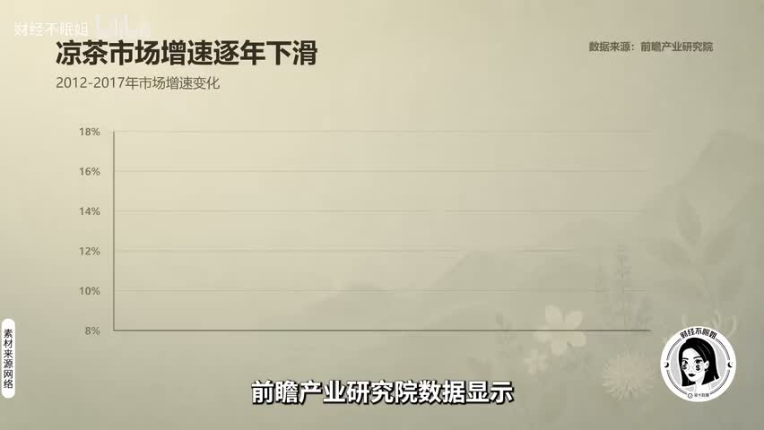
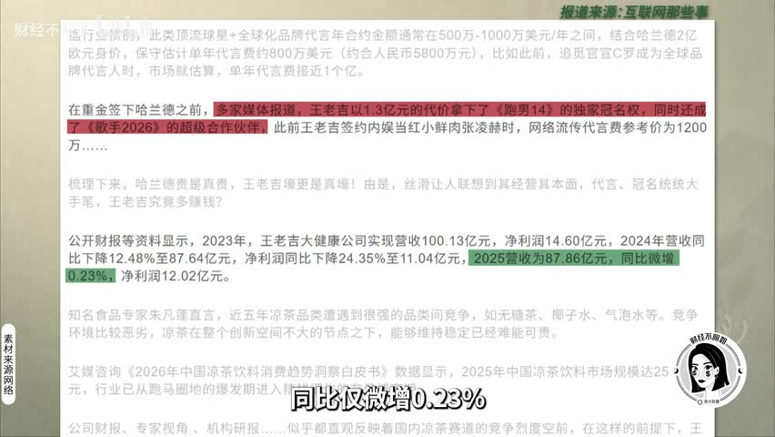

# 三年少卖十个亿：国民凉茶是怎么被换掉的

## 开场：一个数字把人钉住

三年，少卖十个亿。曾经一年卖出 57 亿罐、平均每个中国人喝掉 4 罐的国民饮品，现在年轻人被问起，第一反应是——我上一次喝是什么时候？

*这是原视频自己提出的问题，不是脚本作者加的判断。*

## 背景：它曾经有多火

它叫王老吉。2012 年前后，红罐凉茶年销售额突破 200 亿元，按 3 元一罐折算相当于一年卖掉 57 亿罐；一句「怕上火喝王老吉」把广东的地方饮品，做成了全国人都听得懂的功能概念。

同一时间它还有另一个身份：商标归广药集团，红罐的经营权在鸿道集团、也就是加多宝手里。2023 年凉茶市场约 450 亿元，王老吉占 44%、加多宝 25%——盘子还在，但已经不长了。

## 核心判断：它不是输给官司

多数人以为凉茶是输给了那场官司。不是。真正让它掉队的是三件事同时发生：配方和这一代人的健康偏好正面撞上，使用场景被别的饮料一点点换掉，品牌自己又没能在货架上换出新故事。

*图表是原视频引用的机构数据，口播要说明「据视频引用的数据」，不说成自己的结论。*

## 支撑：三个能落到画面和数字的理由

先说配方。一瓶 480 毫升的凉茶含糖约 40 克，而一块方糖 4 克——等于一瓶下去吃掉 10 块方糖。同一台冰柜里并排站着的是无糖茶、气泡水这些零糖零脂零卡的选择，配料表和趋势正好对着来。

再说场景。凉茶的购买时机基本被锁死在两件事上：吃火锅烧烤这种容易上火的时候，以及年货送礼。问题是这两个场景都在被分流——火锅桌边能选酸梅汤、椰汁、豆奶，年货里能选牛奶、坚果、水果礼盒。

- 一瓶 480 毫升凉茶约含糖 40 克，等于 10 块方糖
- 无糖茶市场规模五年翻了 7 倍多，凉茶品类增速逐年下滑
- 2019 年最高法院认定「全国销量领先的红罐凉茶」不构成虚假宣传，但两家的销量都没回到从前
- 最惨的是当年的老三和其正：2010 年销售额突破 20 亿元、稳居第二，商战打完反而成了小透明

## 收尾前置：把素材变成一套问法

这条素材真正能反复用的地方，不是「王老吉输了」，而是一套问法。碰到任何一个看起来在退场的消费品牌，按顺序问三句：

- 品类增速还在吗？整个凉茶品类都在踩刹车，不是一家公司的胜负问题。
- 使用场景会不会被替代？火锅场景有酸梅汤、椰汁、豆奶，年货场景有牛奶、坚果、水果礼盒。
- 配方和这一代人的偏好对着来吗？高糖配方撞上无糖化趋势，越努力解释越显得不合时宜。

## 收束：对手已经换了

两家公司为商标和包装打了十几年，判决书出来的时候，消费者已经翻篇了——他们问的不是「谁才是真王老吉」，而是「我为什么还要喝一罐高糖凉茶」。
