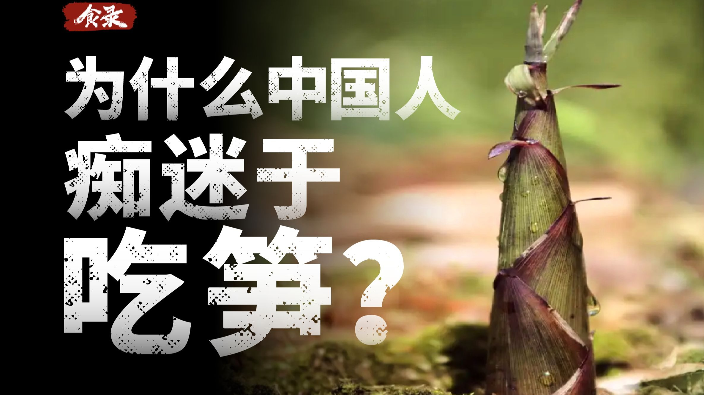
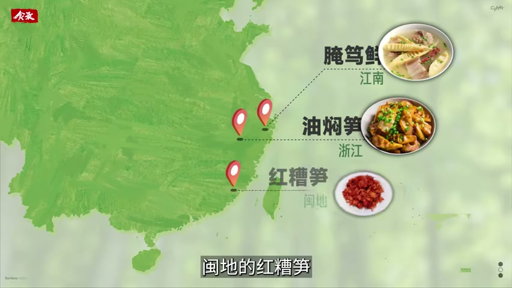
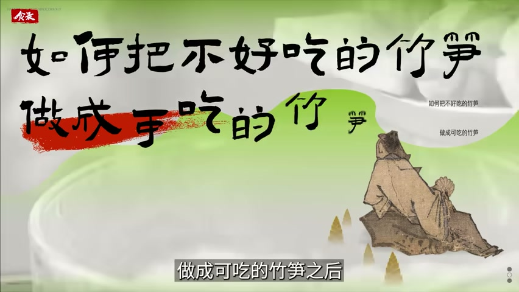
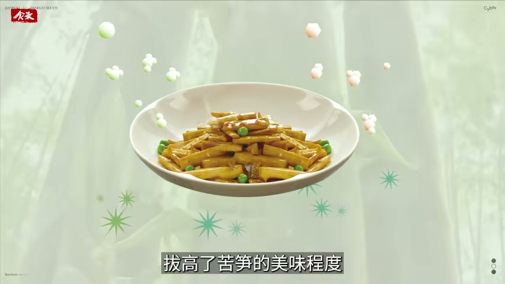
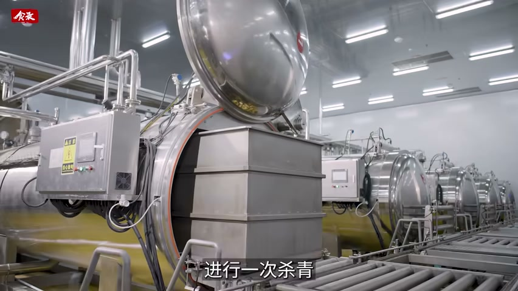

# 为什么除了中国，很少有国家吃笋呢？

## 竹子到处都有，能上桌的笋却要跨过三道门槛

> 视频的回答不是“哪里有竹子哪里就吃笋”，而是：品种能不能吃、产区苦不苦、处理和保存能不能把季节性接成稳定供应，三件事缺一件，竹笋就留在竹林里。

一份基于视频证据的深度总结

- **视频名称**：为什么除了中国，很少有国家吃笋呢？
- **作者/UP主**：赛博食录
- **发布时间**：2025-04-16
- **视频时长**：11分48秒
- **字幕来源**：平台字幕不可用
- **转录来源**：faster-whisper base（CPU int8）逐行审校：269 段修订、84 段保留、36 段标记不确定
- **视频链接**：https://www.bilibili.com/video/BV1tHdoYnEGm

## 它问的不是植物分布，而是食用门槛

地球上超过两千两百万公顷土地生长着竹子，中国的种植面积不到三分之一，消费却占到世界约三分之二；除了中国，只有零星几个国家有吃笋的习惯。视频从这里提出反常识的问题：竹子并不稀有，为什么把它端上日常餐桌的只有中国？

视频给出的答案不是资源和人口的差别，而是一串必须先跨过去的门槛：竹笋要能吃，得先有可食用品种；要有好味道，得先有合适的产区；要让短暂春季变成全年供应，还需要处理、保存和烹饪把这条链路接起来。中国在每一道门槛上都积累了对应的方法。

*这张图支持的是视频对中国地域化食笋方式的展示，不单独证明全球消费统计。*

## 第一道门槛：不是所有竹笋都能吃

视频先排除一个错觉：并不是所有竹笋都可以吃。世界上有一千三百多种竹子，中国境内约五百种，但有的笋太小、采集效率太低，有的纤维硬、苦味重。经过数百上千年的挑选，最终只剩下二十余种常见的可食用竹笋——这是第一道门槛，也是中国祖先筛出来的结果。

第二层变量是产区。气候、地形、土壤和水文都会改变竹笋的风味，所以只挑品种而不挑产区，仍可能吃到一股苦涩。视频把苦涩的部分成因指向光照：竹笋见不得光，光照增强会加速单宁类物质的合成，在口腔里就表现为涩味。

## 第二道门槛：怎么把苦笋变成可吃的笋

第一道处理方法是去掉苦涩并延长保存。视频举出《周礼》里的“加豆之实，笋菹鱼醢”，菹就是腌菜，笋菹的作用正是掩盖苦涩、方便贮藏；《齐民要术》记录了把竹笋煮熟、晒干去苦的做法。这种烟熏发酵、煮熟晒干的古老预处理一直流传至今，酸笋和笋干就是它的后代；越南、印尼、马来西亚用椰浆和椰糖中和苦涩，印度人则用马萨拉粉遮盖。

第二道处理方法不是“去掉”，而是“放大”。视频把油炒视为中国竹笋烹饪的重大突破：蒸煮的挥发性物质容易随水流失，香气淡薄；油炒借助高温和油脂，挥发掉部分清苦气味，同时增加美拉德类等物质，形成焦糖香。油焖笋、炒笋片、爆笋丁的流传，说明中国人在“能吃”之后继续追求“好吃”。

视频还用笋焖肉解释风味为什么能再上一层：肉里的肌苷酸、鸟苷酸与竹笋中的鲜味氨基酸相遇会产生鲜味协同，强度可达五到十倍；竹笋内部多孔的纤维结构又能包裹焖煮时释放的脂溶性香气。苏东坡那句“无竹令人俗，无肉使人瘦，不俗又不瘦，竹笋焖猪肉”，把这条路径写成了中国人的口味记忆。

## 第三道门槛：五小时窗口与全年供应

竹笋还有一道时间门槛。视频提出“五小时黄金时间”的说法：采后如果不做特殊处理，竹笋仍在呼吸，总糖和还原糖、蛋白质与维生素含量会下降，甜味随之流失；与此同时细胞壁物质木质化，口感越来越粗糙。过去南方只能在冬春吃到鲜笋，其余季节靠风干、烟熏、发酵保存，复水后的笋干很难回到鲜笋的脆嫩，甚至带味。

视频后段用一家企业的流程说明现代加工如何承接这个窗口：产地采摘后尽快送入工厂，先用过热蒸汽杀青，去除笋体中的草酸和单宁，最大限度降低苦涩；出锅后经三次冰水浸泡瞬间冷却，锁住鲜味，pH 值保持在 5.5 以上；随后进入零下 45 到 65 摄氏度的超低温冷冻，冷冻过程只需数分钟，以细小冰晶保住弹脆口感。

## 证据边界：哪些是视频说的，哪些是本文归纳

本文区分三类内容。第一类是视频明确表达或展示的：资源与消费的反差、品种与产区门槛、光照与苦涩的关系、传统预处理和油炒的作用、日本遮光栽培、五小时窗口与现代加工流程。第二类是本文的归纳：把上述环节概括成“一条必须接起来的链路”，这是分析框架，不是视频逐字提出的理论。

- 视频后段出现产区与一家企业的加工案例，本文只复述视频展示的环境与流程，不据此推断企业实力、产品效果或市场表现。
- 平台字幕不可用，正文基于 faster-whisper base 转录；审校后有 36 段无法确认，本文不引用这些句子中的专名、数值与化学物质名称。
- 视频中的统计、营养与化学机制均按视频口径使用，本文不做外部独立核实，也不把它们表述为学界共识。

## 来源导航

视频来自 Bilibili 账号赛博食录，2025 年 4 月 16 日发布，时长 11 分 48 秒。平台没有可用的人工字幕，转录由 faster-whisper base 在 CPU 上完成，并经过逐行审校；本文引用画面均来自人工直接检查过的关键帧，时间范围保留在规范记录的 source_spans 中，可按需回溯。
